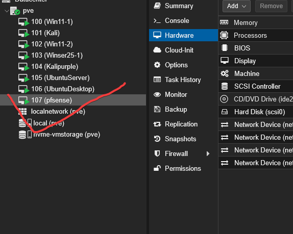
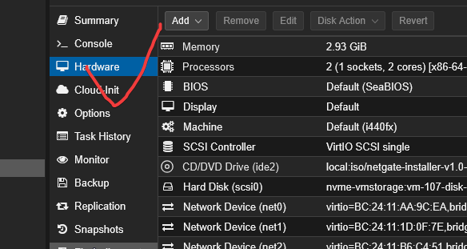
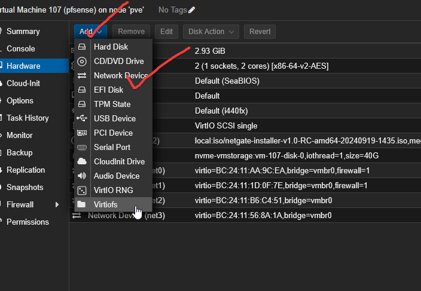
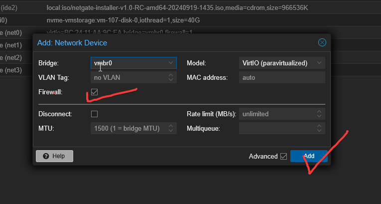

# pfSense Network Appliance Configuration

## Table of Contents

- [Overview](#overview)
- [Initial Setup](#initial-setup)
- [Interface Assignments](#interface-assignments)
- [Create VLANs and Subnets](#create-vlans-and-subnets)
- [Configure DHCP Servers](#configure-dhcp-servers)
- [Firewall Rules](#firewall-rules)
- [Routing and NAT](#routing-and-nat)
- [Testing and Verification](#testing-and-verification)

---

## Overview

This document outlines the configuration steps for pfSense to manage three separate network zones for organizational(xorg), defense (blue team), and attack(red team) infrastructure. Each zone is assigned a unique subnet.

---

## Initial Setup


- Install pfsense following same vm creation steps for entities
- Access pfSense web UI at `https://<pfsense-ip>`.
- Access pfSense web UI at `https://<pfsense-ip>`.
- Access pfSense web UI at `https://<pfsense-ip>`.
- Login with admin credentials.
- Go to **Interfaces > Assignments**.

---

## Interface Assignments

Setting up four adapters for pfsense 1 for WAN and the rest for 3 segmented networks for our entities:

### Steps ###

Click on **Pfsense> Hardware> Add> Network device> Uncheck firewall> Add> Do X3**
  
Step One:

  

Step Two:



Step Three & Four:



Step Five:


  

| Interface | Purpose                   | Description                 |
|-----------|---------------------------|-----------------------------|
| WAN       | External internet          | Connects to uplink/internet |
| LAN1      | Org Network (Subnet 1)    | Organizational subnet       |
| LAN2      | Defense Network (Subnet 2)| Defense subnet              |
| LAN3      | Attack Network (Subnet 3) | Attack subnet               |

1. Assign NICs in **Interfaces > Assignments**:
   - `net0` → WAN
   - `net1` → LAN1
   - `net2` → LAN2
   - `net3` → LAN3

## PF Post-Installation Configuration:

Choose Vtnet0 for WAN


2. Enable each interface and set a static IP address for the subnet gateway.

---

## Create VLANs and Subnets

*(Optional if VLAN tagging is used; otherwise, physical NICs separate subnets.)*

Example VLAN IDs:

- VLAN 10: Org Network
- VLAN 20: Defense Network
- VLAN 30: Attack Network

Configure under **Interfaces > VLANs** if tagging is required.

---

## Configure Subnet IPs (Example)

| Network Zone | Interface | IP Address        | Subnet Mask     | Gateway           |
|--------------|-----------|-------------------|-----------------|-------------------|
| Organizational | LAN1     | 192.168.1.1       | 255.255.255.0   | 192.168.1.1       |
| Defense       | LAN2     | 192.168.2.1       | 255.255.255.0   | 192.168.2.1       |
| Attack        | LAN3     | 192.168.3.1       | 255.255.255.0   | 192.168.3.1       |

---

## Configure DHCP Servers

Enable DHCP for each LAN interface if needed:

- Go to **Services > DHCP Server**.
- Select `LAN1` (Org network):
  - Enable DHCP Server.
  - Define range: e.g., 192.168.1.100 to 192.168.1.200
- Repeat for `LAN2` and `LAN3` with corresponding IP ranges.

---

## Firewall Rules

- By default, pfSense blocks all inbound on interfaces except LAN.
- Add rules on each interface to allow traffic as required.

Example: Allow all traffic within the same subnet

1. Go to **Firewall > Rules**.
2. Select `LAN1`.
3. Add rule:
   - Action: Pass
   - Interface: LAN1
   - Protocol: Any
   - Source: LAN1 subnet
   - Destination: LAN1 subnet
4. Repeat for LAN2 and LAN3.

Example: Restrict traffic between subnets as per your security policy.

---

## Routing and NAT

- Ensure proper routing between interfaces.
- If internet access needed, configure outbound NAT on WAN.
- For isolation, block traffic between VLANs/subnets except allowed flows.

---

## Testing and Verification

- From a device in Org subnet, ping `192.168.1.1` (LAN1 gateway).
- From Org subnet, try to ping Defense and Attack subnets to test firewall restrictions.
- Verify DHCP leases under **Status > DHCP Leases**.
- Use pfSense Diagnostics tools like Ping and Traceroute.

---

## Terminal Commands (pfSense Shell)

You can SSH into pfSense or use the console for some network configurations.

### Viewing interfaces:

```shell
ifconfig
