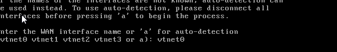
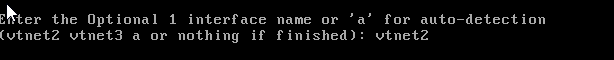

# pfSense Network Appliance Configuration

## Table of Contents

- [Overview](#overview)
- [Initial Setup](#initial-setup)
- [Interface Assignments](#interface-assignments)
- [Pf Post-provisioning Configuration](#Pfsense-Post-provisioning-Configuration)
- [Create VLANs and Subnets](#create-vlans-and-subnets)
- [Configure DHCP Servers](#configure-dhcp-servers)
- [Firewall Rules](#firewall-rules)
- [Routing and NAT](#routing-and-nat)
- [Testing and Verification](#testing-and-verification)

---

## Overview

This document outlines the configuration steps for pfSense to manage three separate network zones for organizational(xorg), defense (blue team), and attack(red team) infrastructure. Each zone is assigned a unique subnet.

---

## Initial Setup


- Install pfsense following same vm creation steps for entities
- Access pfSense web UI at `https://<pfsense-ip>`.
- Access pfSense web UI at `https://<pfsense-ip>`.
- Access pfSense web UI at `https://<pfsense-ip>`.
- Login with admin credentials.
- Go to **Interfaces > Assignments**.

---

## Interface Assignments

Setting up four adapters for pfsense 1 for WAN and the rest for 3 segmented networks for our entities:

### Steps ###

Click on **Pfsense> Hardware> Add> Network device> Uncheck firewall> Add> Do X3**

#### As Follows: ####
  
Step One:

  

Step Two:


Step Three & Four:


Step Five:


  

| Interface | Purpose                   | Description                 |
|-----------|---------------------------|-----------------------------|
| WAN       | External internet          | Connects to uplink/internet |
| LAN1      | Org Network (Subnet 1)    | Organizational subnet       |
| LAN2      | Defense Network (Subnet 2)| Defense subnet              |
| LAN3      | Attack Network (Subnet 3) | Attack subnet               |

1. Assign NICs in **Interfaces > Assignments**:
   - `net0` → WAN
   - `net1` → LAN1
   - `net2` → LAN2
   - `net3` → LAN3

---

## Pf Post-provisioning Configuration

- ### Installation ###

Start pfsense  VM and select novnc view to proceed gui installation


Click enter to accept


And enter to ok " install pfsense "


Ok to continue

Choose Vtnet0 for WAN


Select ok "Enter" to continue


Continue with ok by clicking enter.  After connection check, also 'enter' to 'install CE'

Finally pfsense begins installation


Reboot with enter


Do vlans need to be setup first? type no and enter


Enter wan interface name: vtnet0 and enter



Enter LAN interface name: vtnet1


Enter optional 1 interface name: vtnet2



Optional interface 2: vtnet3


Interface assigned as follows:
   - WAN -> vtnet0
   - LAN -> vtnet1
   - OPT1 -> vtnet2
   - OPT2 -> vtnet3

 

y & 'enter'  to proceed

Installation complete...


- ### Interface Setup ###

Note: Interface 1- vtnet0(WAN) is put aside for now.

1. Interface 2: LAN- vnet1

Enter 2 to see available interfaces for set up


Select 2, for LAN - second interface **IP via DHCP ? N> New LAN IPv4: 10.0.1.1> Subnet bit count: 24> for a WAN enter new gateway address: 'enter'> Config IPv6 via DHCP? N> Enter new LAN IPv6 : 'enter'>**

above steps:


Continued:
**Want to enable DHCP server on LAN? Y> Enter start address: 10.0.1.2> Enter end addr of IPv4 client addr range: 10.0.1.245> Revert to HTTP as webconfigurator protocol? N> DONE**


Enter to continue to next interface setup.

2. Interface 3: OPT1- vnet2

Select 3 **Config via DHCP? N> Enter new OPT1 IPv4 addr: 10.0.2.1> Enter new OPT1 IPv4 bitcount: 24> For a WAN enter new OPT1 gateway addr: Not WAN 'enter' and continue> Configure IPv6 addrr OPT1 interface via DHCP6: N> Enter new OPT1 IPv6 addr: Enter> Enable DHCP server on OPT1? Y>**

Above steps:


Continued:
**Enter start addr of the IPv4 client addr range: 10.0.2.2> Enter end addr of IPv4 client addr range: 10.0.2.245> DONE**


Enter to continue to next interface setup

3. Interface 4: OPT2 - vnet3

Select 4 (4 & enter) **Config via DHCP? N> Enter new OPT1 IPv4 addr: 10.0.3.1> Enter new OPT1 IPv4 bitcount: 24> For a WAN enter new OPT1 gateway addr: Not WAN 'enter' and continue> Configure IPv6 addrr OPT1 interface via DHCP6: N> Enter new OPT1 IPv6 addr: Enter> Enable DHCP server on OPT1? Y>**

Above steps:


Continued:
**Enter start addr of the IPv4 client addr range: 10.0.3.2> Enter end addr of IPv4 client addr range: 10.0.3.245> DONE**


2. Enable each interface and set a static IP address for the subnet gateway.

---

## Create VLANs and Subnets

*(Optional if VLAN tagging is used; otherwise, physical NICs separate subnets.)*

Example VLAN IDs:

- VLAN 10: Org Network
- VLAN 20: Defense Network
- VLAN 30: Attack Network

Configure under **Interfaces > VLANs** if tagging is required.

---

## Configure Subnet IPs (Example)

| Network Zone | Interface | IP Address        | Subnet Mask     | Gateway           |
|--------------|-----------|-------------------|-----------------|-------------------|
| Organizational | LAN1     | 192.168.1.1       | 255.255.255.0   | 192.168.1.1       |
| Defense       | LAN2     | 192.168.2.1       | 255.255.255.0   | 192.168.2.1       |
| Attack        | LAN3     | 192.168.3.1       | 255.255.255.0   | 192.168.3.1       |

---

## Configure DHCP Servers

Enable DHCP for each LAN interface if needed:

- Go to **Services > DHCP Server**.
- Select `LAN1` (Org network):
  - Enable DHCP Server.
  - Define range: e.g., 192.168.1.100 to 192.168.1.200
- Repeat for `LAN2` and `LAN3` with corresponding IP ranges.

---

## Firewall Rules

- By default, pfSense blocks all inbound on interfaces except LAN.
- Add rules on each interface to allow traffic as required.

Example: Allow all traffic within the same subnet

1. Go to **Firewall > Rules**.
2. Select `LAN1`.
3. Add rule:
   - Action: Pass
   - Interface: LAN1
   - Protocol: Any
   - Source: LAN1 subnet
   - Destination: LAN1 subnet
4. Repeat for LAN2 and LAN3.

Example: Restrict traffic between subnets as per your security policy.

---

## Routing and NAT

- Ensure proper routing between interfaces.
- If internet access needed, configure outbound NAT on WAN.
- For isolation, block traffic between VLANs/subnets except allowed flows.

---

## Testing and Verification

- From a device in Org subnet, ping `192.168.1.1` (LAN1 gateway).
- From Org subnet, try to ping Defense and Attack subnets to test firewall restrictions.
- Verify DHCP leases under **Status > DHCP Leases**.
- Use pfSense Diagnostics tools like Ping and Traceroute.

---

## Terminal Commands (pfSense Shell)

You can SSH into pfSense or use the console for some network configurations.

### Viewing interfaces:

```shell
ifconfig
