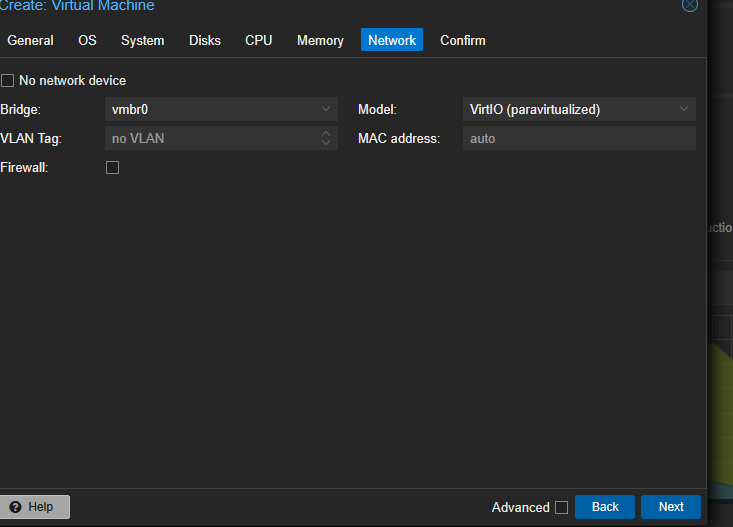

# Proxmox Documentation

## Table of Contents

- [Introduction](#introduction)
- [Installation](#installation)
- [Initial Configuration](#initial-configuration)
  - [Network Setup](#network-setup)
  - [Storage Setup](#storage-setup)
- [Virtual Machines Management](#virtual-machines-management)
  - [Creating a VM](#creating-a-vm)
  - [ISO Upload](#iso-upload)
  - [Backup and Restore](#backup-and-restore)
- [Networking in Proxmox](#networking-in-proxmox)
  - [Bridges and VLANs](#bridges-and-vlans)
  - [Firewall Configuration](#firewall-configuration)
- [Snapshots and Maintenance](#snapshots-and-maintenance)
- [Troubleshooting](#troubleshooting)
- [Version History](#version-history)
- [Appendices](#appendices)

---

## Introduction

This document covers the installation, setup, and management of Proxmox VE for virtualization purposes. It is designed to support the simulation of organizational, attack, and defense network entities.

---

## Installation

1. **Download the latest Proxmox VE ISO** from the official [Proxmox Downloads](https://www.proxmox.com/en/downloads) page.
2. Create a bootable USB using tools like **Rufus** or **Etcher**.
3. Boot the target server from the USB.
4. Follow the installer prompts:
   - Select target hard drive.
   - Configure country, time zone, and keyboard layout.
   - Set root password and email.
   - Configure network (temporary, final config later).
5. Complete installation and reboot.

---

## Initial Configuration

### Network Setup

- Access Proxmox web UI at `https://<server-ip>:8006`.
- Login with root credentials.
- Navigate to **Datacenter > Node > Network**.
- Edit default bridge `vmbr0` or create new bridges as needed.
- Configure IP addresses, netmask, gateway.
- Add VLANs if necessary (use Linux VLAN interfaces).
- Example for creating a bridge:
auto vmbr1
iface vmbr1 inet static
address 192.168.100.1
netmask 255.255.255.0
bridge_ports eno1
bridge_stp off
bridge_fd 0

- Save and apply changes.

### Storage Setup

- Go to **Datacenter > Storage**.
- Add new storage (Directory, LVM, ZFS, NFS, etc.).
- Define storage roles (ISO images, containers, VM disks, backups).
- Upload ISO images for VM installation.

---

## Virtual Machines Management

### Creating a VM

1. Click **Create VM** on the top right. or right click pve node:  

2. Fill in VM ID and Name (no space).  

3.Next:OS- Select ISO image, OS type, Version, check additional drivers for   VirtIO drivers-Iso Image: Select Virtio for windows:
4. Choose System Settings: Check- Qemu agent, Add TPM and select storage, Add EFI DISK   and select storage (windows 11 only) then next .
5. Next:Chose Disk size.  

6. Configure CPU -Cores, Memory  
 and  
7. Add network interfaces (bridge standard: `vmbr0` or other and deselect firewall).  .
8. Review and finish - check Start after created if desired.  

### ISO Upload

- Go to **Datacenter > Storage > ISO Storage**.
- Click **Upload**.
- Select ISO file from your computer.
- Wait for upload to complete before using.

### Backup and Restore

- Navigate to **Datacenter > Backup**.
- Create backup jobs specifying schedule and target storage.
- Restore VMs by selecting backups and clicking **Restore**.

---

## Networking in Proxmox

### Bridges and VLANs

- Bridges (`vmbr0`, `vmbr1`, etc.) connect VMs to physical or virtual networks.
- VLAN tagging allows network segmentation.
- Example VLAN config:

auto vlan10
iface vlan10 inet manual
vlan-raw-device eno1

- Assign VLAN interfaces to bridges as needed.

### Firewall Configuration

- Proxmox has built-in firewall options.
- Enable firewall per **Datacenter**, **Node**, **VM** level.
- Define rules to restrict traffic.
- Use tags to group rules.
- Monitor logs for blocked traffic.

---

## Snapshots and Maintenance

- Snapshots allow VM state saves.
- To create a snapshot:
- Select VM > Snapshots > Take Snapshot.
- Name and add description.
- Regularly update Proxmox:
apt update && apt full-upgrade

- Monitor hardware health via Proxmox dashboard.

---

## Troubleshooting

- Check Proxmox logs in `/var/log/pve/`.
- Use `journalctl` for system logs.
- Network issues often solved by reviewing bridge and VLAN configs.
- Use `qm` CLI tool for VM troubleshooting.

---

## Version History

| Version | Date       | Description           |
|---------|------------|-----------------------|
| 1.0     | 2025-08-10 | Initial document draft |
| 1.1     | 2025-08-12 | Added network section  |

---

## Appendices

- Useful commands:
- List VMs: `qm list`
- Start VM: `qm start <vmid>`
- Stop VM: `qm stop <vmid>`
- Proxmox official docs: https://pve.proxmox.com/wiki/Main_Page

---

