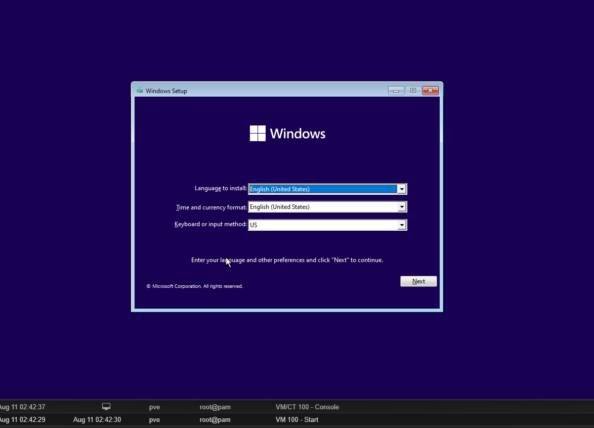
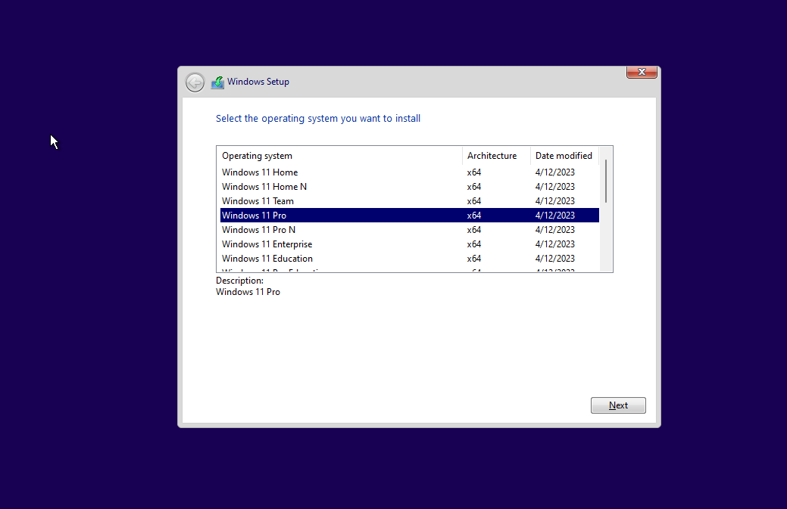
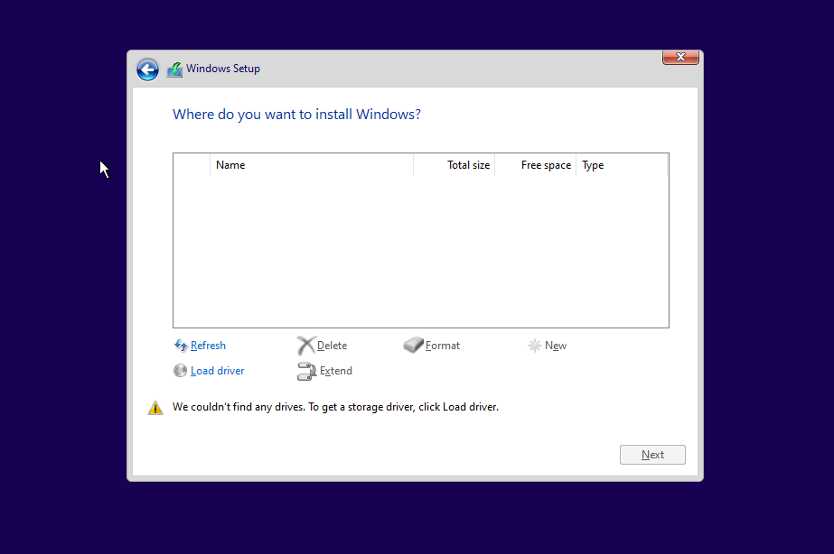
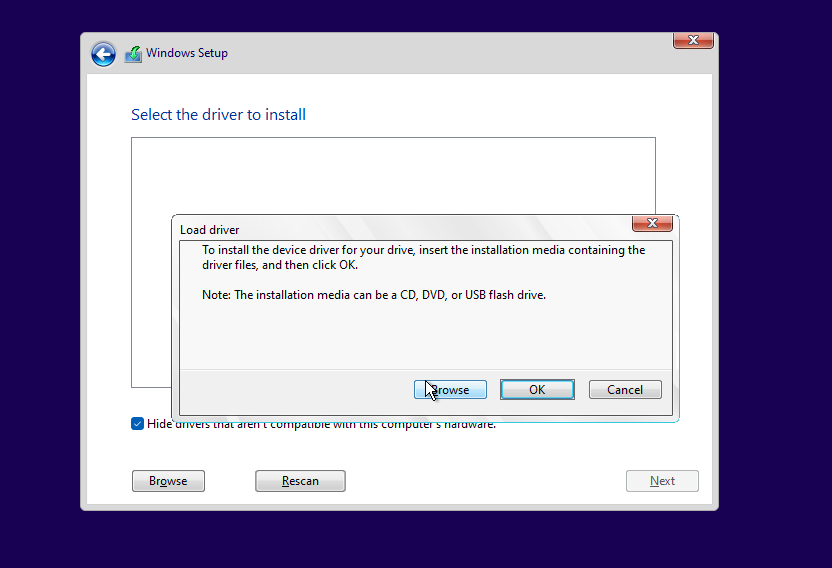
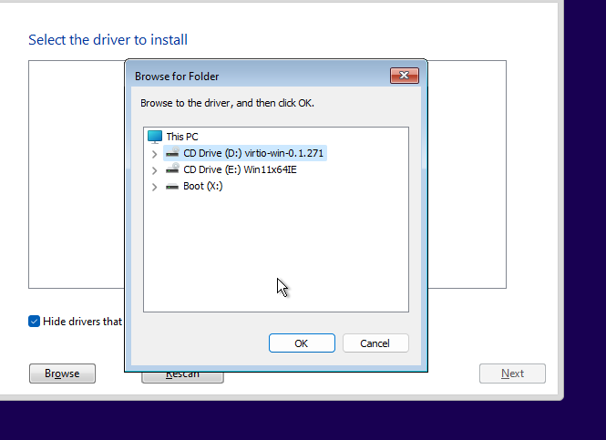
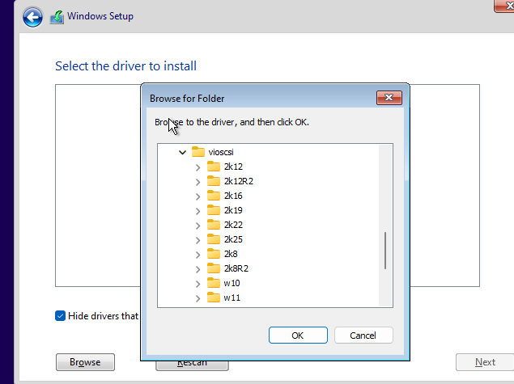
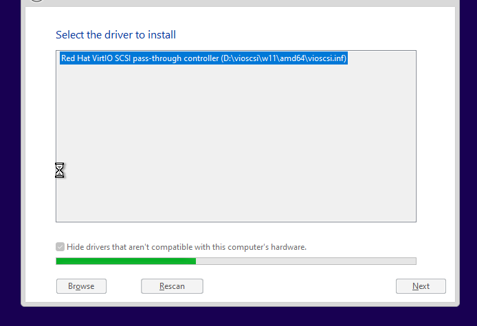
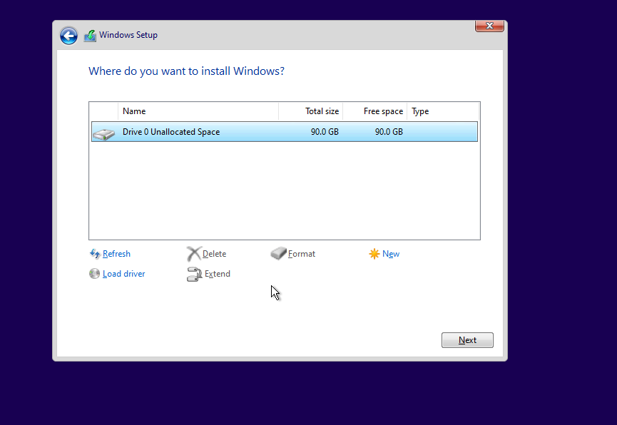
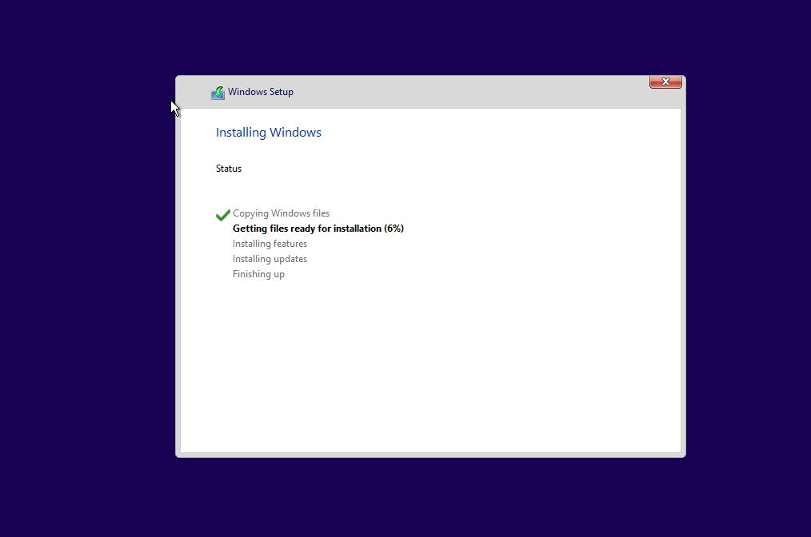

# Entities Infrastructure Overview

## Table of Contents
- [Organizational Infrastructure](#organizational-infrastructure)
  - [VMs](#organizational-vms)
  - [Network](#organizational-network)
  - [Workflows and Actions](#organizational-workflows-and-actions)
- [Defense Infrastructure](#defense-infrastructure)
  - [VMs](#defense-vms)
  - [Network](#defense-network)
  - [Workflows and Actions](#defense-workflows-and-actions)
- [Attack Infrastructure](#attack-infrastructure)
  - [VMs](#attack-vms)
  - [Network](#attack-network)
  - [Workflows and Actions](#attack-workflows-and-actions)

---

## Organizational Infrastructure

### Organizational VMs

#### Windows-Server-01  
**Title:** Domain Controller  
- OS: Windows Server 2022  
- Role: Active Directory Domain Services (AD DS)  
- Installed tools: AD DS, DNS, DHCP, Group Policy Management  
- Key actions:  
  - Create/manage users and groups
  1.   
  - Enforce group policies  
  - Domain join operations  

#### Windows-Server-02  
**Title:** Application Server  
- OS: Windows Server 2019  
- Role: Host internal business applications  
- Installed tools: IIS, SQL Server (if applicable)  
- Key actions: Serve internal apps, DB hosting 

#### Windows-11-01  
**Title:** User Workstation A  
- OS: Windows 10 Pro  
- Role: Standard user endpoint  
- Installed tools: Office Suite, VPN client  
- Key actions: Day-to-day business tasks 

##### Installation & Configuration
1. Start VM and clicl on console or consle drop down top right and novnc. Press any   key to begin installtion  
2. Select OS version to install and accept license terms  
3. System couldn't find any drives to install OS  
Load missing drivers: 
**Click on load drivers> browse > Virtio CD Drive> vioscsi> w11> Select amd64 > select ok> Next>**  
  1. Browse:  
  .   
  2. Expand Virtio loaded on one of the two CD Drives:  .  
  3. Find and select win 11:  
  .  
  4. Next:  
  
  5. Next:  
  
  6. Installing windows:  
  

#### Windows-11-02  
**Title:** User Workstation B  
- OS: Windows 10 Pro  
- Role: Standard user endpoint  
- Installed tools: Office Suite, VPN client  
- Key actions: Day-to-day business tasks  

#### Windows-11-03  
**Title:** User Workstation C  
- OS: Windows 10 Pro  
- Role: Standard user endpoint  
- Installed tools: Office Suite, VPN client  
- Key actions: Day-to-day business tasks  

---

### Organizational Network
- Subnet: `192.168.1.0/24`  
- VLAN: `10`  
- Firewall: Allow internal comms, restrict external except business apps  

---

### Organizational Workflows and Actions
- User provisioning via DC  
- File access with permissions based on AD groups  
- Application hosting for internal use  
- Workstations authenticate via AD  

---

## Defense Infrastructure

### Defense VMs

#### Ubuntu-Server-01  
**Title:** Wazuh SIEM Server  
- OS: Ubuntu Server 22.04  
- Role: Security monitoring and log aggregation  
- Installed tools: Wazuh Manager, Filebeat, ElasticSearch  
- Key actions: Collect logs, generate alerts  

#### Windows-10-03  
**Title:** Atomic Red Team Executor  
- OS: Windows 10 Pro  
- Role: Simulated attack generation  
- Installed tools: Atomic Red Team, PowerShell Empire  
- Key actions: Execute simulated attacks, generate telemetry  

#### Kali-Linux-01  
**Title:** Kali Purple  
- OS: Kali Linux Purple Edition  
- Role: Defensive monitoring and threat hunting  
- Installed tools: Suricata, ELK, Zeek  
- Key actions: Network monitoring, IDS/IPS tuning  

#### Ubuntu-Server-02  
**Title:** Velociraptor Server  
- OS: Ubuntu Server 22.04  
- Role: Digital forensics and incident response  
- Installed tools: Velociraptor  
- Key actions: Endpoint investigation, artifact collection  

#### Ubuntu-Server-03  
**Title:** Security Tools Host  
- OS: Ubuntu Server 22.04  
- Role: Miscellaneous security tool hosting  
- Installed tools: (Specify as deployed)  
- Key actions: Run supporting defensive tools  

---

### Defense Network
- Subnet: `192.168.2.0/24`  
- VLAN: `20`  
- Firewall: Monitor and control inbound/outbound traffic between org and attack  

---

### Defense Workflows and Actions
- Receive logs from org VMs into SIEM  
- Execute Atomic Red Team scenarios against org for testing  
- Monitor and respond to alerts in SIEM  
- Conduct forensic investigations when triggered  

---

## Attack Infrastructure

### Attack VMs

#### Ubuntu-Server-04  
**Title:** C2 Server  
- OS: Ubuntu Server 20.04  
- Role: Command and Control for offensive ops  
- Installed tools: Cobalt Strike, Empire C2  
- Key actions: Manage compromised hosts  

#### Kali-Linux-02  
**Title:** Offensive Tools Host  
- OS: Kali Linux Rolling  
- Role: Penetration testing and exploitation  
- Installed tools: Metasploit, Nmap, Burp Suite  
- Key actions: Recon, scanning, exploitation  

#### Ubuntu-Server-05  
**Title:** Exploit Development Server  
- OS: Ubuntu Server 20.04  
- Role: Exploit and payload development  
- Installed tools: Custom scripts, exploit frameworks  
- Key actions: Build and test exploits  

#### Kali-Linux-03  
**Title:** Recon & Phishing Host  
- OS: Kali Linux Rolling  
- Role: Social engineering and recon operations  
- Installed tools: GoPhish, Maltego  
- Key actions: Run phishing campaigns, gather intel  

---

### Attack Network
- Subnet: `192.168.3.0/24`  
- VLAN: `30`  
- Firewall: Isolated except through controlled test points  

---

### Attack Workflows and Actions
- Launch recon and exploitation campaigns  
- Deploy payloads via C2 server  
- Maintain persistence and monitor compromised endpoints  
- Feed results into SIEM for defensive correlation  
