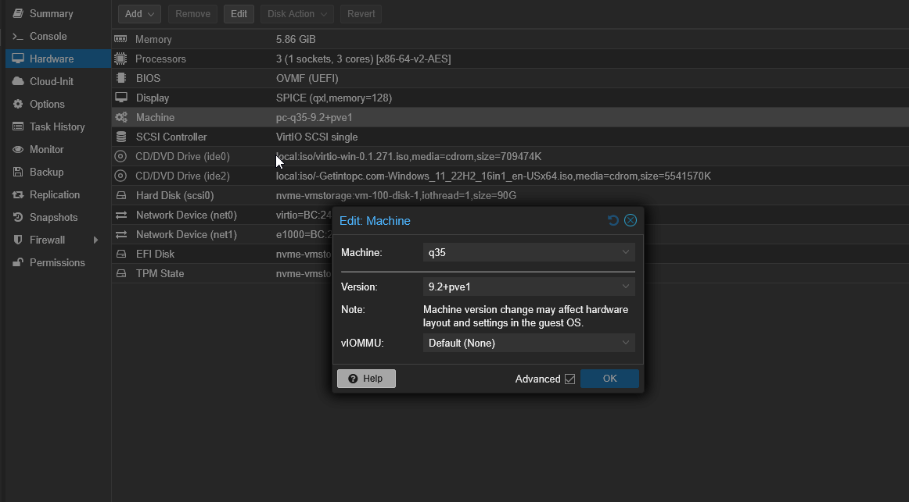

# Tools Inventory

## Table of Contents

- [Proxmox Tools](#proxmox-tools)
- [Network Tools](#network-tools)
- [Security Tools](#security-tools)

---

## Proxmox Tools

- CLI commands (`qm`, `pvesh`, `pct`)
- Web UI features

### Install SPICE viewer ###

WHY
- Enhances usability of proxmox vm's
- Provides set of features for enhanced desktop experience
- Excellent tool for high performance Virt ie, enales cross vm copying

HOW

1. Install SPICE to the system used to access VM - Proxmox Go https://virt-manager.org/download > under virt-viewer > download for your OS
2. Return to proxmox and to vm you want to use spice for Click on vm>Hardware>Display - double click> Change- Graphic card: SPICE> Memory: 128> ok 

3. Machine- double click> Machine: q35 (If not already set)

## Network Tools

- Wireshark
- Nmap
- Tcpdump

## Security Tools

- Metasploit
- Snort
- Suricata
